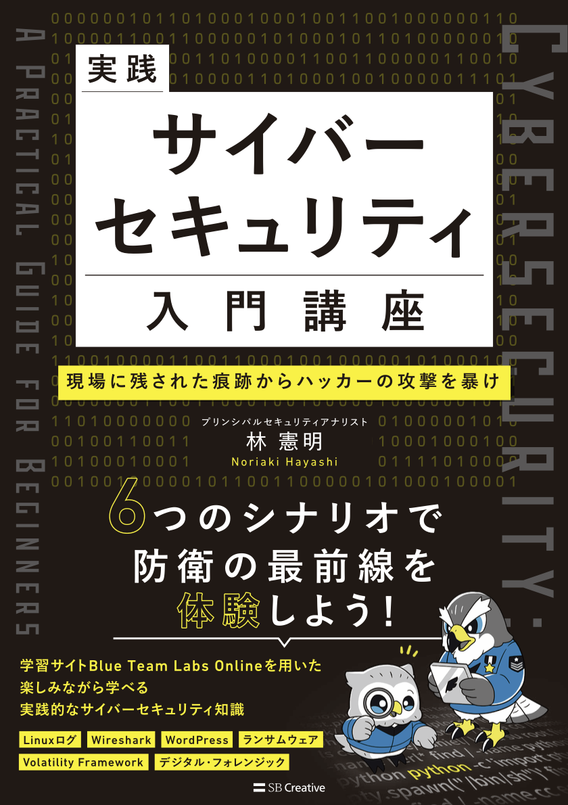

# 『実践サイバーセキュリティ入門講座 現場に残された痕跡からハッカーの攻撃を暴け』サポートリポジトリ
『実践サイバーセキュリティ入門講座 現場に残された痕跡からハッカーの攻撃を暴け』（SBクリエイティブ）のサポートリポジトリです。
書籍内に掲載された画面キャプチャーのフルカラー版や正誤表をご参照いただけます。

SBクリエイティブの書籍紹介ページ:https://www.sbcr.jp/product/4815634254/

  

## 正誤表
[errata.md](./errata.md) に随時追加します。

## フルカラー版画面キャプチャー
[figure](./figure) に各章のフルカラー版 画面キャプチャーがあります。

## このレポジトリへのコントリビュートに関して
[CONTRIBUTING.md](./CONTRIBUTING.md) をご確認ください。